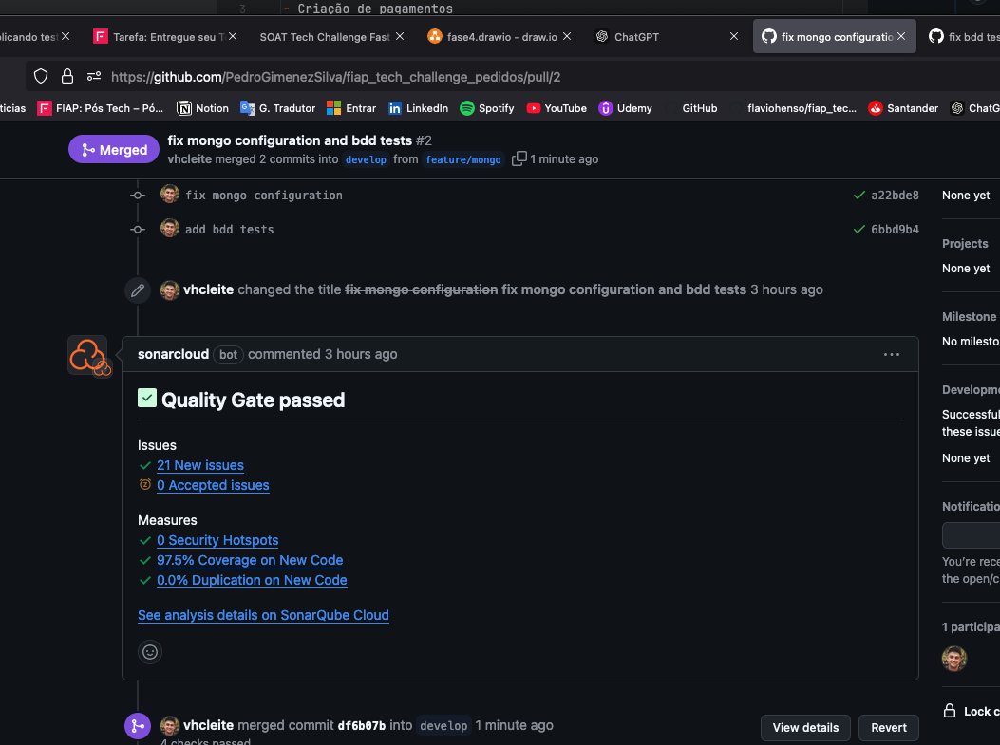

# API Pedidos

- Criação de pedidos;
- Atualização de pedidos;
- Acompanhamento de pedidos pelza cozinha;
- Acompanhamento de pedidos individuais;

### Banco de dados:

DocumentDb

Link de
uma [verificação de cobertura](https://github.com/PedroGimenezSilva/fiap_tech_challenge_pedidos/actions/runs/12192110385).

Imagem de verificação de cobertura no repositório:

